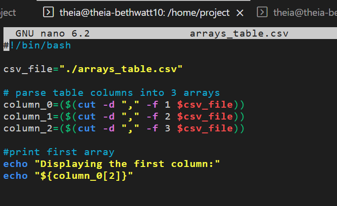
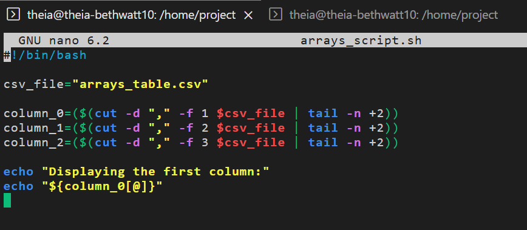

# Arrays and For Loops Lab

## What I Did
This lab introduced arrays in bash scripting — a way to store and 
access multiple values at once. The script reads data from a CSV file, 
parses it into three separate arrays by column, and displays the results.

## The Script
The script pulls data from `arrays_table.csv`, splits it into three 
columns using the `cut` command, and stores each column as an array. 
It then displays the values from the first column.

## How It Went
This was the most challenging lab so far. At some point the CSV file 
got corrupted — it looked like data had been accidentally written into 
it instead of the script file. To fix it, I had to create a new CSV, 
copy a clean version of the data into it, and start fresh.

Once the file path issue was sorted out (the script was referencing 
`./arrays_table.csv` but needed just `arrays_table.csv`), the script 
ran and displayed the first column correctly — outputting `1 4 7 10`.

I also used Claude AI to help troubleshoot some of the errors along 
the way, which helped me understand what was going wrong with the 
file path and array syntax.

## Screenshots

### First Draft of the Script

### Downloading and Fixing the CSV

### Updated Script with Fix

