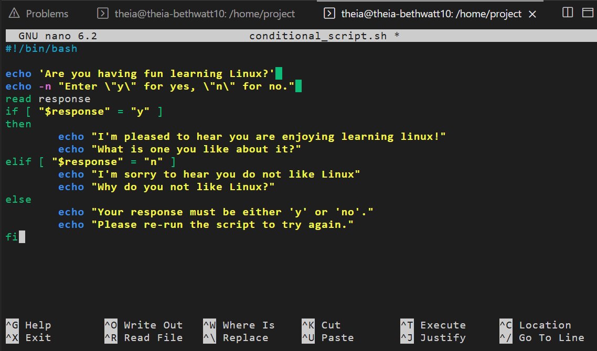
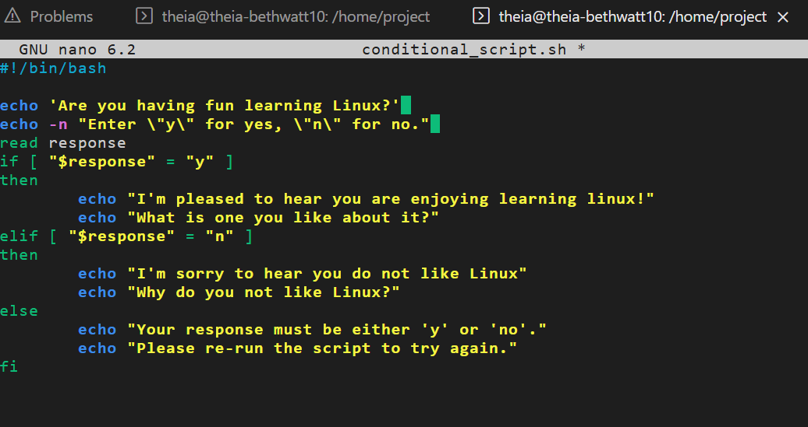
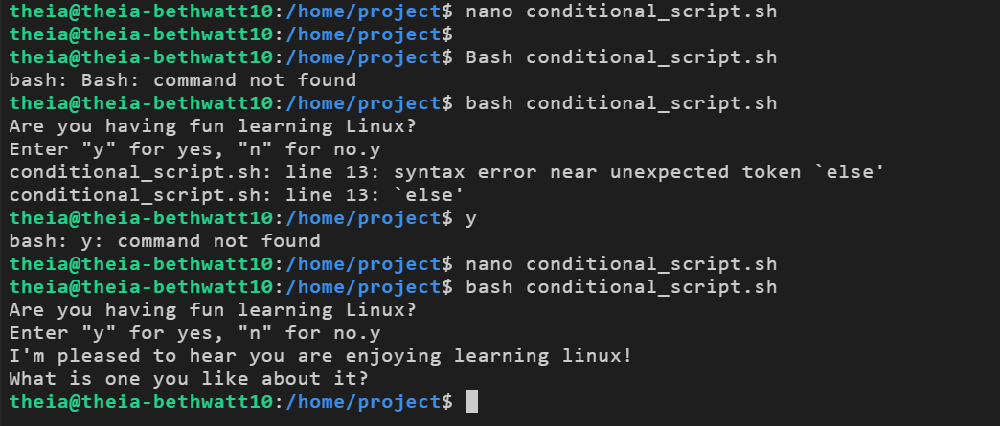

# Conditional Statements Lab

## What I Did
Conditional statements let a script make decisions based on user input 
or system conditions — basically the if/then logic of bash scripting.

This lab had me build a bash script that asks the user a question 
and responds based on what they type.

## The Script
The script asks "Are you having fun learning Linux?" and waits for 
a y or n answer. Depending on what you enter, it gives a different response.

## How It Went
Ran into a syntax error on the first try — turns out I was missing 
a `then` after the `elif` line. Once that was added it ran perfectly.

## Screenshots

### Writing the Script

### Fixing the Syntax Error

### Running It Successfully

