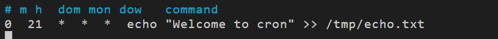
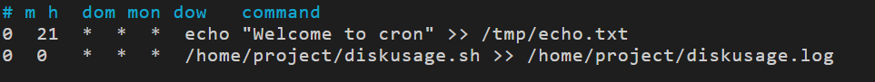
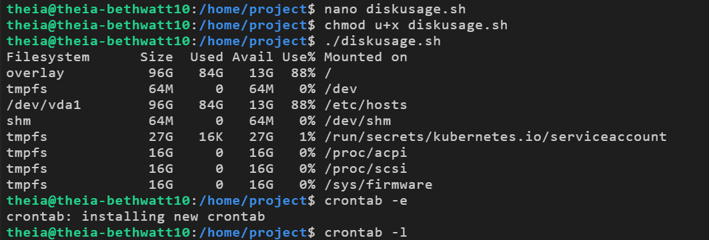
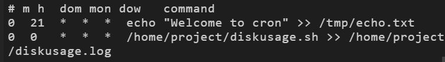
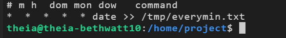
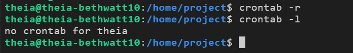

# Cron Jobs Lab

## What I Did
Cron jobs let me schedule commands or scripts to run automatically at specific 
times or intervals — basically the automation tool of Linux system administration.
This lab had me create a shell script and schedule it to run using crontab.

## The Script
Created a disk usage script called `diskusage.sh` that logs filesystem information.
It was then scheduled alongside an echo command to run at set times every day,
and a third job was added to run every single minute.

## How It Went
Used `crontab -e` to add and manage jobs, `crontab -l` to verify they were 
installed correctly, and `crontab -r` to remove them all at the end. 
Everything ran as expected once the cron syntax was correct.

## Screenshots

### Setting Up the Cron Jobs

### Two Jobs Scheduled

### Every Minute Job Added

### Running the Disk Usage Script and Installing Crontab

### Verifying Cron Jobs

### Confirming Output

### Every Minute Job Running

### Removing All Cron Jobs

