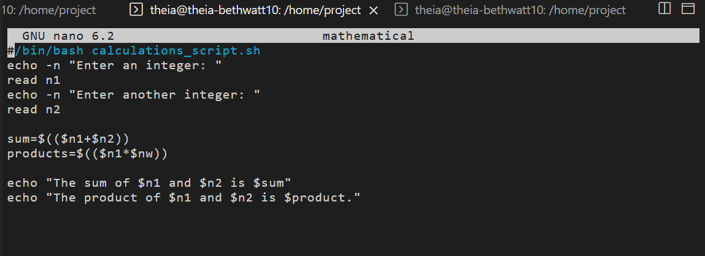
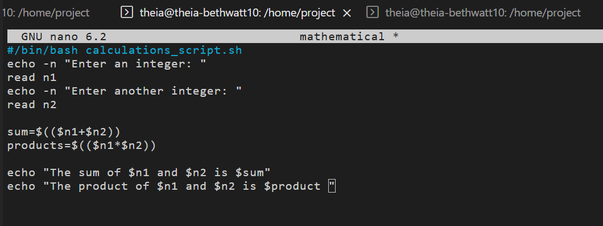
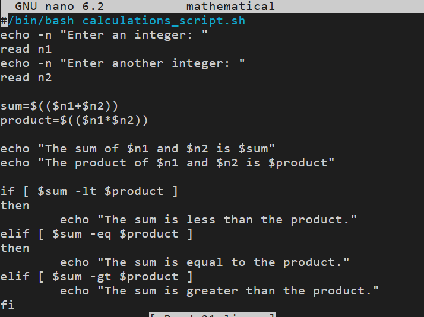
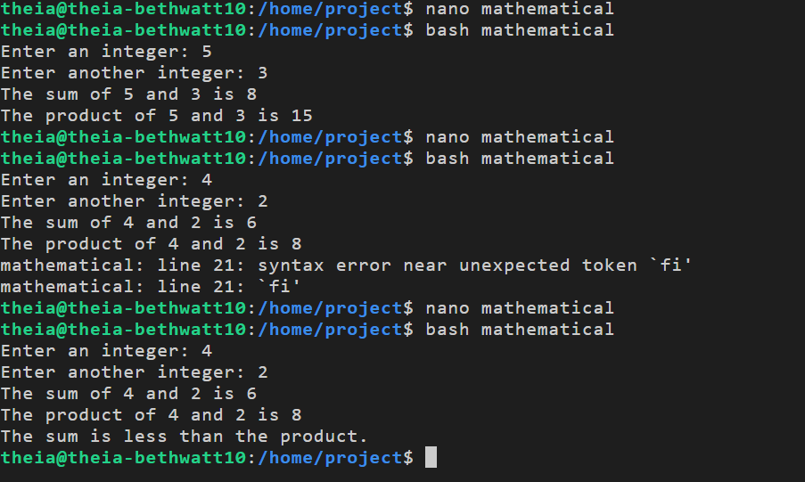

# Mathematical Calculations Lab

## What I Did
This lab had me write a bash script that takes two integers from the 
user and performs mathematical calculations on them — addition and 
multiplication — then compares the results.

## The Script
The script asks for two numbers, calculates the sum and product, 
then uses conditional statements to compare which is greater.

## How It Went
First run worked fine for the basic sum and product. Hit a typo on 
the first attempt — used `$nw` instead of `$n2` for the product 
variable, and also had `products` instead of `product`. Fixed those 
and it ran correctly.

Then added the comparison logic (if/elif) to check whether the sum 
was less than, equal to, or greater than the product. Got a syntax 
error near `fi` on the first try but fixed it and the full script 
ran successfully. I needed to add the `then` statement after the `elif` but before `fi`.

## Screenshots

### First Draft of the Script

### Fixing the Typos

### First Successful Run

### Adding the Comparison Logic

### Final Successful Run

